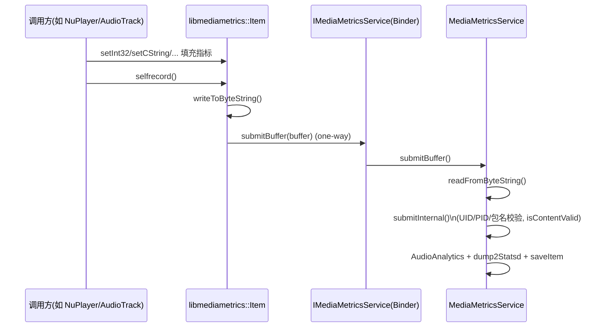

# Android 12 `libmediametrics` 实现与上层交互梳理

本文聚焦 `android-12/media/libmediametrics`，并结合 `android-12/services/mediametrics` 与典型调用方，梳理 Android 12 中媒体指标（MediaMetrics）的上报与读取链路。

## 1. 模块定位

- **客户端库（本目录）**：`android-12/media/libmediametrics`
  - 对外 C API：`include/media/MediaMetrics.h`
  - 核心实现：`MediaMetrics.cpp`、`MediaMetricsItem.cpp`
  - Binder/AIDL 接口：`aidl/android/media/IMediaMetricsService.aidl`
- **服务端**：`android-12/services/mediametrics`
  - 服务实现：`MediaMetricsService.h/.cpp`
  - 进程入口：`main_mediametrics.cpp`

核心设计：调用方构造 `mediametrics::Item`，序列化为 bytes 后通过 one-way Binder 投递给 `media.metrics` 服务。

---

## 2. `libmediametrics` 关键实现

### 2.1 C 接口到 C++ 对象

文件：`android-12/media/libmediametrics/MediaMetrics.cpp`

- `mediametrics_create()` -> `Item::create(key)`
- `mediametrics_setInt32()/setCString()/...` -> `Item::set*()`
- `mediametrics_selfRecord()` -> `Item::selfrecord()`

即：C API 只是薄封装，实际逻辑在 `mediametrics::Item`。

### 2.2 selfrecord 上报路径

文件：`android-12/media/libmediametrics/MediaMetricsItem.cpp`

- `Item::selfrecord()`
  1. `writeToByteString()` 序列化 item
  2. `BaseItem::submitBuffer()` 提交二进制 buffer
- `BaseItem::submitBuffer()`
  - 通过 `getService()` 获取 `media.metrics`
  - 使用 one-way Binder 调用 `IMediaMetricsService::submitBuffer`

### 2.3 AIDL 与 Binder 细节

- AIDL：`android-12/media/libmediametrics/aidl/android/media/IMediaMetricsService.aidl`
  - `oneway void submitBuffer(in byte[] buffer);`
- 代理实现：`android-12/media/libmediametrics/IMediaMetricsService.cpp`
  - `BpMediaMetricsService::submitBuffer()`
  - `BnMediaMetricsService::onTransact()` 分发 `SUBMIT_BUFFER`

---

## 3. 服务端处理逻辑（`media.metrics`）

### 3.1 服务注册与运行

文件：`android-12/services/mediametrics/main_mediametrics.cpp`

- 进程启动后注册服务名：`MediaMetricsService::kServiceName = "media.metrics"`
- `addService("media.metrics", new MediaMetricsService())`

### 3.2 submitBuffer 到落地

文件：`android-12/services/mediametrics/MediaMetricsService.h/.cpp`

- `submitBuffer(const char* buffer, size_t length)`
  1. `Item::readFromByteString()` 反序列化
  2. `submitInternal(item, true)`
- `submitInternal()` 主要工作
  - 根据调用 UID 判断 trusted/untrusted
  - 补齐/覆盖 UID、PID、包名、versionCode
  - `isContentValid()` 做 key 白名单校验（非 trusted 调用方）
  - 时间戳修正
  - 提交 `AudioAnalytics` / `dump2Statsd`
  - `saveItem()` 入内存队列（用于 dumpsys / pull atom）

---

## 4. 与上层应用交互、调用关系（Android 12）

> 说明：本仓（`frameworks/av`）主要覆盖 native 侧。Java Framework 层 `android.media.*` 对 `native` 的调用入口不在本仓，但本仓可见从客户端 API 到 mediaserver/mediametrics service 的完整 native 链路。

### 4.1 指标“上报”链路（写路径）

典型调用方（本仓可见）包括：

- `android-12/media/libmediaplayerservice/nuplayer/NuPlayerDriver.cpp`（`mMetricsItem->selfrecord()`）
- `android-12/media/libaudioclient/include/media/AudioTrack.h`（析构中 `selfrecord()`）
- `android-12/media/libaudioclient/include/media/AudioRecord.h`（析构中 `selfrecord()`）
- `android-12/media/libstagefright/RemoteMediaExtractor.cpp`（析构中 `selfrecord()`）

这些模块通常运行在媒体服务相关进程中（如 mediaserver / audioserver 侧组件），在关键生命周期节点将聚合指标上报到 `media.metrics`。

### 4.2 指标“读取”链路（getMetrics）

同一批 `mediametrics::Item` 也可用于 `getMetrics()` 返回给上层：

- `StagefrightRecorder::getMetrics(Parcel*)`：`mMetricsItem->writeToParcel(reply)`
- `MediaRecorderClient::getMetrics(Parcel*)`：向下转发到 recorder 实现
- `MediaRecorder::getMetrics(Parcel*)`：客户端侧发起 Binder 调用

即：上层（应用/Framework）可通过 `getMetrics()` 读到由 native 组件维护的指标快照；同时 native 组件也可通过 `selfrecord()` 异步上报到系统统计服务。

---

## 5. 流程图

### 5.1 组件交互总览

```mermaid
flowchart LR
    A[应用层 API\nMediaPlayer/MediaRecorder 等] --> B[Framework Native 客户端\nlibmedia / libmediaplayerservice]
    B --> C[libmediametrics\nItem + C API]
    C --> D[Binder oneway\nIMediaMetricsService.submitBuffer]
    D --> E[mediametrics 进程\nMediaMetricsService]
    E --> F[AudioAnalytics / statsd]
    E --> G[内存队列 mItems\n(dumpsys / pull)]

    B -. getMetrics .-> H[Parcel 指标回传]
    H -. 返回 .-> A
```

### 5.2 `selfrecord()` 上报时序



---

## 6. 关键文件速查

- `android-12/media/libmediametrics/include/media/MediaMetrics.h`
- `android-12/media/libmediametrics/include/media/MediaMetricsItem.h`
- `android-12/media/libmediametrics/MediaMetrics.cpp`
- `android-12/media/libmediametrics/MediaMetricsItem.cpp`
- `android-12/media/libmediametrics/IMediaMetricsService.cpp`
- `android-12/media/libmediametrics/aidl/android/media/IMediaMetricsService.aidl`
- `android-12/services/mediametrics/main_mediametrics.cpp`
- `android-12/services/mediametrics/MediaMetricsService.h`
- `android-12/services/mediametrics/MediaMetricsService.cpp`
